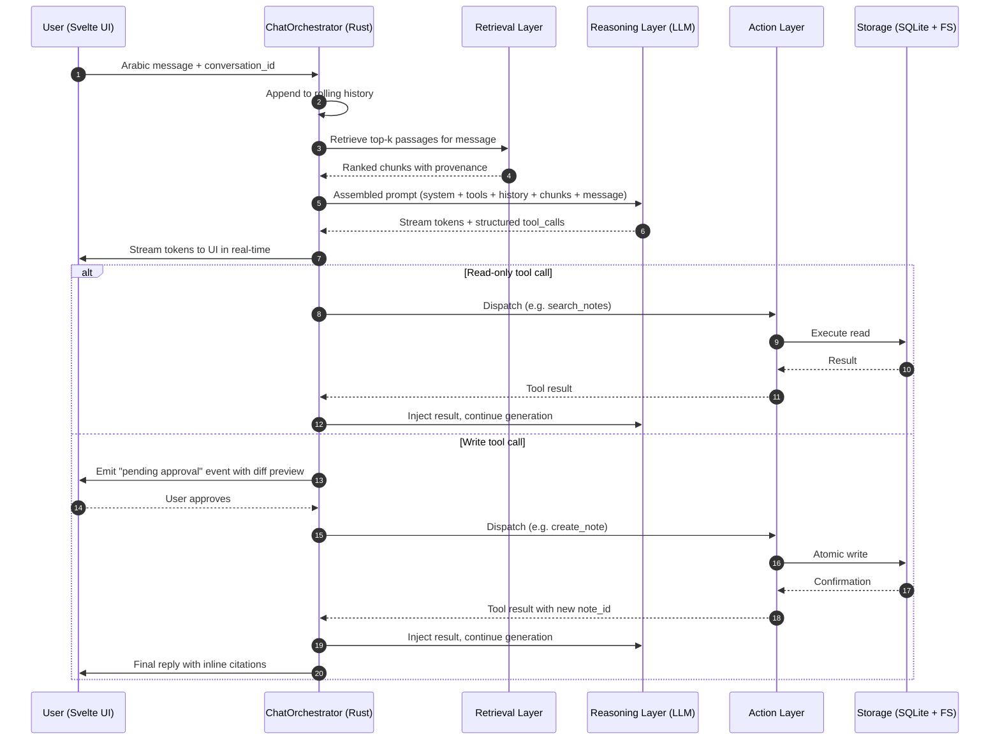

# Constellation Mind — عقل Constellation

## A Design Concept & Concept Paper for the Local Large Language Model Layer of Constellation

### From Personal Knowledge Management (PKM) to Personal Knowledge Formulation (PKF), Through Citation-Bound, Arabic-First, Local Intelligence

---

**Author:** Eisa — Founder & Lead Developer, Constellation
**Domain:** uconstellation.world
**Document Version:** 1.0 — Concept Paper
**Date:** May 24, 2026
**Status:** Architectural Concept — Pre-Implementation
**Classification:** Internal Research & Public Vision Document
**Companion Documents:** Constellation Import Engine (CIE) Concept Paper · Hybrid Multilingual Search Engine Concept Paper · GraphMind Recovery Plan · Note Type Taxonomy

---

## Table of Contents

1. [Executive Summary (الملخص التنفيذي)](#1-executive-summary)
2. [Strategic Context & The PKF Wager](#2-strategic-context--the-pkf-wager)
3. [The Problem with PKM in the LLM Era](#3-the-problem-with-pkm-in-the-llm-era)
4. [Foundations — What a Large Language Model (LLM) Actually Is](#4-foundations--what-a-large-language-model-llm-actually-is)
5. [Design Principles (المبادئ التصميمية)](#5-design-principles)
6. [The Conceptual Architecture — Constellation Mind](#6-the-conceptual-architecture--constellation-mind)
7. [The Two-Zone Trust Model](#7-the-two-zone-trust-model)
8. [The Tool Palette — Constellation Cortex](#8-the-tool-palette--constellation-cortex)
9. [Model Selection Matrix — Arabic-First Defaults](#9-model-selection-matrix--arabic-first-defaults)
10. [Rust Implementation — The `InferenceProvider` Trait & The Mind Subsystem](#10-rust-implementation)
11. [The Conversational User Experience (UX)](#11-the-conversational-user-experience-ux)
12. [Phased Implementation Roadmap (خارطة الطريق)](#12-phased-implementation-roadmap)
13. [Risk Register & Mitigations](#13-risk-register--mitigations)
14. [Strategic Differentiation — Why This Revolutionizes PKM Toward PKF](#14-strategic-differentiation)
15. [Open Research Questions](#15-open-research-questions)
16. [References](#16-references)
17. [Glossary (مسرد المصطلحات)](#17-glossary)
18. [Appendix A — Sample Prompts (Arabic & English)](#appendix-a--sample-prompts)
19. [Appendix B — JSON Tool Schema Example](#appendix-b--json-tool-schema-example)

---

## 1. Executive Summary

### English

Constellation is built on a non-negotiable thesis: a **Personal Knowledge Formulation (PKF)** system must not merely store knowledge — it must help its owner *formulate* knowledge, meaning to create, connect, challenge, and synthesize. Large Language Models (LLMs) are the first technology capable of operating at that verb. But naive integration — chat-with-your-notes wrappers around cloud Application Programming Interfaces (APIs) — fails the PKF contract on three fronts: privacy is leaked, provenance is hallucinated, and the system's identity is surrendered to a remote vendor.

This concept paper proposes **Constellation Mind (عقل Constellation)** — a three-layer local-first intelligence subsystem that integrates a Large Language Model into Constellation under four binding constraints: **local-first execution**, **citation-bound generation**, **two-zone trust separation between reading and writing**, and **Arabic-first model selection with Right-to-Left (RTL) conversational rendering**.

The subsystem comprises:

1. **The Retrieval Layer (طبقة الاسترجاع)** — already shipped: hybrid Best Matching 25 (BM25) + semantic search with Reciprocal Rank Fusion (RRF) over a Qdrant vector index.
2. **The Reasoning Layer (طبقة الاستدلال)** — new: a Rust-native inference runtime (`mistral.rs` or `llama-cpp-2`) streaming tokens from a quantized Arabic-capable model (Fanar-1-9B as bundled default; Qwen3 / Falcon-Arabic / Jais-2 as user-selectable alternatives).
3. **The Action Layer (طبقة الفعل)** — new: a strictly typed, confirmation-gated tool dispatcher that lets the LLM *act* on the Universe — create notes, link them, classify them — but never silently.

The deliverable is not a chatbot. It is the cognitive surface of Constellation: a conversational, Arabic-native, locally-running, write-capable counterpart that knows everything you have ever written and can only speak about it with citation.

### العربية

Constellation مبني على أطروحة غير قابلة للتفاوض: نظام **بناء المعرفة الشخصية (Personal Knowledge Formulation — PKF)** لا يقتصر على تخزين المعرفة، بل يساعد صاحبه على *بنائها* — أي إنشاؤها، والربط بينها، ومساءلتها، وتركيبها. النماذج اللغوية الكبيرة (Large Language Models — LLMs) هي أول تقنية قادرة على العمل عند هذا الفعل. لكن الدمج الساذج — مجرد واجهة محادثة فوق واجهات برمجة تطبيقات (Application Programming Interfaces — APIs) سحابية — يُسقط عقد PKF من ثلاث جهات: تُسرَّب الخصوصية، ويُختلَق الإسناد، وتُسلَّم هوية النظام إلى مورد بعيد.

تقترح هذه الورقة المفاهيمية **عقل Constellation (Constellation Mind)** — منظومة ذكاء محلية ثلاثية الطبقات تدمج النموذج اللغوي الكبير في Constellation تحت أربعة قيود ملزمة: **التنفيذ المحلي أولاً**، **التوليد المقيَّد بالإسناد**، **الفصل بين منطقتي ثقة للقراءة والكتابة**، و**انتقاء النموذج بأولوية عربية مع عرض محادثة من اليمين إلى اليسار (Right-to-Left — RTL)**.

تتألف المنظومة من ثلاث طبقات: **طبقة الاسترجاع** المتوفرة فعلياً، و**طبقة الاستدلال** الجديدة المعتمدة على بيئة استدلال أصلية بلغة Rust، و**طبقة الفعل** الجديدة التي تتيح للنموذج التصرف في الكون المعرفي للمستخدم تحت بوابة موافقة صريحة. الناتج ليس روبوت محادثة، بل السطح المعرفي لـ Constellation: رفيقٌ محادِث، عربيُّ الأصل، يعمل محلياً، قادر على القراءة والكتابة، يعرف كل ما كتبته يوماً، ولا يتحدث عنه إلا بإسناد.

---

## 2. Strategic Context & The PKF Wager

Constellation entered an already-crowded category. Obsidian, Logseq, Notion, Roam Research, Evernote, and Joplin all compete on roughly the same Personal Knowledge Management (PKM) axes: capture speed, link density, plugin ecosystem, sync reliability. Choosing to enter this market without a real differentiator would have been strategic suicide.

The PKF wager is the differentiator: Constellation rejects the noun *management* and commits to the verb *formulation*. Management is custodial — store, retrieve, organize. Formulation is generative — create, connect, challenge, synthesize. That single linguistic choice is load-bearing for every architectural decision downstream, and it is exactly what an LLM, used disciplined, makes possible for the first time.

Three structural commitments flow from the PKF wager:

1. **Arabic-first and RTL-first.** Not as a localization layer, but as an architectural foundation. The world has hundreds of millions of Arabic-language knowledge workers and no PKF tool built for them. This is a market position no incumbent can match without a ground-up rebuild.
2. **Local-first.** Knowledge work generates the most sensitive corpus a person owns. Outsourcing it to a remote inference endpoint contradicts the act of *owning* one's knowledge.
3. **Open-source, Tauri/Rust/Svelte.** Performance and portability that Electron-based incumbents (Obsidian, Logseq, Notion-desktop) cannot match without a comparable rewrite.

Constellation Mind is the cognitive payoff of those three commitments. Without an LLM layer, Constellation is a faster, prettier, Arabic-friendly note-taker. With it, Constellation is the first PKF system that fulfils the verb in its name.

---

## 3. The Problem with PKM in the LLM Era

Every major PKM tool has, in the period 2023–2025, bolted an LLM onto its existing surface. The pattern is now stereotyped:

- **Notion AI** — cloud-only, sends note content to a remote provider, no provenance binding, opaque retention.
- **Obsidian** community plugins (`Smart Connections`, `Copilot`, etc.) — improving rapidly, but uneven; most route to OpenAI by default; citation discipline varies; Arabic and RTL handling is an afterthought.
- **Logseq** — early LLM plugins, similar architecture problems.
- **Reflect**, **Mem**, **Tana**, **Capacities** — cloud-first by design; the user's corpus *is* the vendor's training-adjacent surface.

The failure modes are consistent:

| Failure mode | Manifestation |
|---|---|
| **Hallucinated provenance** | The LLM fabricates a citation to a note that doesn't exist, or attributes a claim to the wrong note. |
| **Privacy capitulation** | The user's full corpus, or unbounded subsets of it, leaves the device. |
| **Trust-zone confusion** | A single chat surface mixes read and write operations with no confirmation pattern; the LLM silently edits or "improves" notes. |
| **English-monoglot ergonomics** | RTL rendering is broken in chat panes; Arabic tokenization degrades retrieval quality; the model's instruction-tuning bias toward English bleeds into output. |
| **Vendor capture** | The PKM tool's intelligence is owned by an external vendor; the user's experience can be silently degraded, deprecated, or upcharged. |
| **No clean separation between retrieval and generation** | The LLM is asked to "search and answer" as a single opaque call, with no inspection point, no override, no graceful degradation. |

The pattern is not malicious — it is the result of treating an LLM as a feature to ship quickly, rather than as a subsystem to architect carefully. Constellation has the luxury of architecting from a blank surface.

---

## 4. Foundations — What a Large Language Model (LLM) Actually Is

A **Large Language Model (LLM)** is a Transformer-architecture (المُحوِّل) neural network trained to predict the next token (وحدة رمزية) in a sequence, given the preceding context. Three properties matter for our purposes:

1. **Statistical, not deterministic.** The model produces probability distributions over tokens; sampling from those distributions yields fluent text but does not yield ground truth. Anything that *must* be true must come from outside the model — from retrieval, from tools, from validation.
2. **Context-window-bounded.** The model reasons only over tokens it can see. Memory across conversations is *engineered*, not innate; it is constructed by appending history, retrieved chunks, and tool outputs into the prompt.
3. **Instruction-following is a trained behavior.** Pre-training yields next-token prediction; only Supervised Fine-Tuning (SFT) and preference alignment (Reinforcement Learning from Human Feedback — RLHF, or Direct Preference Optimization — DPO) yield the assistant behavior we recognize. The *quality* of the instruction-tuning data determines whether the model reliably calls tools, cites sources, and respects refusal boundaries.

The relevant capabilities for Constellation are:

| LLM capability | Constellation use |
|---|---|
| **Embedding generation (توليد المتجهات)** | Semantic search, already in production via the `ort` crate |
| **Conditional generation (التوليد الشرطي)** | Answer composition, summarization, drafting |
| **Few-shot classification (التصنيف بأمثلة قليلة)** | Note-type facet auto-classification |
| **Function calling / tool use (استدعاء الدوال)** | The Action Layer — write operations against the Universe |
| **Multilingual reasoning** | Arabic ↔ English ↔ other languages, including in the same conversation |
| **Long-context reasoning** | Summarizing folders, libraries, or entire Universes |

What an LLM is *not*, and never will be:

- Not a database. Retrieval is a separate subsystem.
- Not a knowledge graph. The graph (your Constellation Lens) is a separate subsystem.
- Not a truth source. Truth is whatever your notes say, with citations.
- Not a deterministic reasoner. It approximates reasoning through pattern; for anything provable, use a verifier (logic, code execution, retrieval).

The discipline of Constellation Mind is to use the LLM exactly where it is strong and to refuse to use it where it is weak.

---

## 5. Design Principles

The architecture commits to eight principles. Each is a binding constraint, not a nice-to-have.

### 5.1 Local-First (المحلية أولاً)

All inference defaults to on-device. Cloud inference is an explicitly toggled, per-user, per-Universe opt-in. The Reasoning Layer's contract is identical regardless of where the model runs.

### 5.2 Citation-Bound Generation (الإسناد الإلزامي)

Every factual claim in a generated response must cite the source note(s) by stable identifier. The LLM cannot produce a "fact" that is not anchored to the retrieved context. This is enforced through structured-output prompting and a post-generation validator.

### 5.3 Two-Zone Trust Separation (فصل مناطق الثقة)

Read operations and write operations live in distinct execution lanes with distinct confirmation contracts. The LLM may *propose* writes; only the user *commits* writes. Atomic by default, undoable always.

### 5.4 Arabic-First Model Selection (انتقاء النموذج بأولوية عربية)

The bundled default model must demonstrate strong Modern Standard Arabic (الفصحى) competence and reasonable Gulf-dialect coverage. Model swaps are first-class, but the default ships configured for Arabic, not English.

### 5.5 Provider Abstraction (تجريد المزود)

A single `InferenceProvider` trait gates the entire LLM surface. Local, remote, multiple-provider, ensemble, and offline-fallback variants all implement the same interface. No part of the Constellation core depends on a specific model or runtime.

### 5.6 Graceful Degradation (التراجع الرشيق)

If the model is unavailable, slow, or off-budget, the Universe remains fully functional. The LLM layer is *additive*, never *load-bearing* for core PKF operations.

### 5.7 Determinism Where Possible (الحتمية حيث أمكن)

Embedding-based retrieval, taxonomy classification, and tool dispatch are deterministic operations. The LLM is only invoked where its specific strengths — fluent composition, multilingual paraphrase, contextual judgment — are needed.

### 5.8 Sunni-Aware, Heritage-Conscious Defaults

For religious and heritage content, the bundled model and system prompts must respect the Sunni scholarly tradition by default — not as content censorship, but as alignment with the user base. Fanar-1-9B's deliberate Islamic-values alignment makes it the natural default for this user base.

---

## 6. The Conceptual Architecture — Constellation Mind

### 6.1 The Three Layers

**Constellation Mind** is the umbrella name for the LLM intelligence subsystem. It comprises three layers, each with a single responsibility and a clean interface to its neighbors.

```
┌─────────────────────────────────────────────────────────────────┐
│                      USER (SVELTE 5 / RTL UI)                   │
│                  Chat surface  •  Approval modal                │
└──────────────────────────────────┬──────────────────────────────┘
                                   │ Tauri IPC
┌──────────────────────────────────▼──────────────────────────────┐
│                CONSTELLATION MIND (Rust core)                   │
│                                                                 │
│  ┌───────────────────────────────────────────────────────────┐  │
│  │  ACTION LAYER  (طبقة الفعل)                               │  │
│  │  Tool dispatcher  •  Confirmation gate  •  Atomic writes  │  │
│  └───────────────────────────────────────────────────────────┘  │
│                              ▲                                  │
│  ┌───────────────────────────┴───────────────────────────────┐  │
│  │  REASONING LAYER  (طبقة الاستدلال)                        │  │
│  │  InferenceProvider trait  •  mistral.rs / llama-cpp-2     │  │
│  │  Prompt assembler  •  Streaming tokens & tool calls       │  │
│  └───────────────────────────────────────────────────────────┘  │
│                              ▲                                  │
│  ┌───────────────────────────┴───────────────────────────────┐  │
│  │  RETRIEVAL LAYER  (طبقة الاسترجاع) — already shipped      │  │
│  │  Hybrid BM25 + Semantic (RRF) over Qdrant + ort           │  │
│  └───────────────────────────────────────────────────────────┘  │
└─────────────────────────────────┬───────────────────────────────┘
                                  │
┌─────────────────────────────────▼───────────────────────────────┐
│            UNIVERSE  •  LIBRARY  •  FOLDER  •  NOTE             │
│            (SQLite + Filesystem — single source of truth)       │
└─────────────────────────────────────────────────────────────────┘
```

### 6.2 Data Flow for One Conversational Turn

A single user message traverses the stack as follows:



### 6.3 The Prompt Envelope

Every LLM invocation is constructed from a fixed envelope. No free-form prompting from the UI ever reaches the model.

```
┌─────────────────────────────────────────────────────────────┐
│ SYSTEM PROMPT                                               │
│ • Identity:      "You are Constellation Mind ..."           │
│ • Style:         RTL-aware, MSA Arabic when input is Arabic │
│ • Citation rule: every claim cites [note:UUID]              │
│ • Refusal rule:  if retrieval is empty, say so explicitly   │
│ • Tool schemas:  read & write tools with strict JSON schema │
├─────────────────────────────────────────────────────────────┤
│ CONVERSATION HISTORY (rolling window or summarized)         │
├─────────────────────────────────────────────────────────────┤
│ RETRIEVED CONTEXT                                           │
│ <chunk id="note:UUID/section:n">...</chunk>                 │
│ <chunk id="note:UUID/section:m">...</chunk>                 │
├─────────────────────────────────────────────────────────────┤
│ TOOL RESULTS (this turn)                                    │
│ <tool_result name="search_notes">...</tool_result>          │
├─────────────────────────────────────────────────────────────┤
│ USER MESSAGE                                                │
└─────────────────────────────────────────────────────────────┘
```

---

## 7. The Two-Zone Trust Model

Read and write operations live in distinct trust zones with distinct guarantees.

### 7.1 Zone R — Read

Read operations execute immediately upon LLM tool call. The user does not see an approval modal for reads. The user *does* see, in the chat UI, a transparent log entry showing which tool was called and which notes were touched — this is auditability, not approval.

**Guarantees:**
- No side effects on the Universe.
- No data leaves the device (unless Cloud Provider is enabled, in which case the cloud egress is itself logged).
- Every retrieved chunk is rendered in the answer with a clickable citation back to the note.

### 7.2 Zone W — Write

Write operations *propose* a change. They do not execute until the user explicitly approves through the User Interface (UI).

**Guarantees:**
- Atomicity: a write either fully succeeds or fully fails — no half-applied changes.
- Diff preview: the user sees the exact textual change before approving (insertion, modification, deletion).
- Undo: every write is journaled and reversible within the active session, and durable undo persists for a configurable window (default 30 days).
- Batch-aware: if the LLM proposes multiple writes (e.g. "create five notes and link them"), the UI presents the full bundle for single-decision approval, not five sequential nags.

### 7.3 The Confirmation Contract

```
┌───────────────────────────────────────────────────────────┐
│  LLM proposes:                                            │
│    create_note(                                           │
│      title: "الدرور في الخليج العربي",                     │
│      folder: "علم الفلك العربي/التقاويم",                  │
│      content: <250 words>,                                │
│      links: [note:abc, note:def]                          │
│    )                                                      │
│                                                           │
│  [Preview]  [Approve]  [Edit then Approve]  [Reject]      │
└───────────────────────────────────────────────────────────┘
```

After the user decides, the LLM is informed of the outcome and continues the conversation. A rejection does not end the turn — it becomes part of the conversation history, so the user can negotiate ("Reject, but try again with a shorter content section").

---

## 8. The Tool Palette — Constellation Cortex

The Action Layer exposes a fixed, strictly-typed set of tools to the LLM. The palette is intentionally small. New tools are added only when (a) the LLM cannot achieve the user's intent through existing tools, and (b) the new tool has a clear safety contract.

### 8.1 Read Tools (Zone R)

| Tool | Signature | Purpose |
|---|---|---|
| `search_notes` | `(query: str, library?: id, k: int=10) -> [Note]` | Hybrid retrieval, returns ranked notes |
| `read_note` | `(note_id: id) -> Note` | Full note content + metadata |
| `find_similar` | `(note_id: id, k: int=5) -> [Note]` | Embedding-nearest neighbors |
| `summarize` | `(target: id, granularity: enum) -> str` | Summarize note/folder/library |
| `list_recent` | `(since: timestamp, facet?: str) -> [Note]` | Time-ordered enumeration |
| `graph_neighbors` | `(note_id: id, depth: int=1) -> Graph` | Constellation Lens local subgraph |

### 8.2 Write Tools (Zone W)

| Tool | Signature | Confirmation level |
|---|---|---|
| `create_note` | `(title, content, folder_id, facets?, links?) -> NoteId` | Single-step approval |
| `update_note` | `(note_id, mode: append\|replace\|patch, content) -> ()` | Single-step approval with diff |
| `link_notes` | `(from: id, to: id, relation: str) -> ()` | Single-step approval |
| `tag_note` | `(note_id, facets: dict) -> ()` | Single-step approval (batchable) |
| `move_note` | `(note_id, target_folder: id) -> ()` | Single-step approval |
| `delete_note` | `(note_id) -> ()` | **Double-confirmation, always** |
| `batch_apply` | `(operations: [Op]) -> ()` | Atomic batch with single bundle approval |

### 8.3 Capability Tools (Reserved for Future Expansion)

| Tool | Notes |
|---|---|
| `transcribe_audio` | Bridges to your `whisper-rs` voice pipeline |
| `ocr_image` | Bridges to your PaddleOCR PP-OCRv5 pipeline |
| `translate` | Bridges to your three-layer linguistic engine |
| `cite_external` | Future: fetch and ingest external sources |

The capability tools are how Constellation Mind composes the intelligence layers you have already built. The LLM does not own these capabilities — it *orchestrates* them.

---

## 9. Model Selection Matrix — Arabic-First Defaults

### 9.1 Selection Criteria

A model qualifies as a Constellation Mind candidate if and only if it satisfies all of:

1. **Arabic competence**: scores ≥ 60% on ArabicMMLU or equivalent.
2. **Tool-use capability**: documented function-calling support or instruction-tuned for tool calls.
3. **Open weights**: redistributable under terms compatible with Constellation's bundling.
4. **Quantizable**: 4-bit Q4_K_M GGUF (Georgi Gerganov Universal Format) variant available or producible.
5. **Active maintenance**: released or updated within the past 12 months.

### 9.2 Candidate Matrix

| Model | Params | Origin | Arabic | Tool use | Bundling fit | Notes |
|---|---|---|---|---|---|---|
| **Fanar-1-9B** | 9B | QCRI / HBKU, Qatar | Excellent (MSA + Gulf/Levantine/Egyptian dialects) | Inherits from Gemma 2 base | **Bundled default** | Deliberately Islamic-values-aligned, Sunni-aware, Arabic-first |
| **Qwen3-8B** | 8B | Alibaba | Strong | Native, Hermes-style tool format, Qwen-Agent framework | First-class alternative | Best documented tool-calling story in this class |
| **Falcon-Arabic-7B** | 7B | TII, UAE | Excellent | Inherits from Falcon 3 | First-class alternative | Strong on Arabic MMLU / Exams / MadinahQA / AraTrust |
| **ALLaM-7B-instruct** | 7B | SDAIA, KSA | Strong | Instruction-tuned | Available | Solid on Emirati-dialect benchmarks |
| **Jais-2-8B** | 8B | Inception (G42, UAE) + MBZUAI | Excellent (Arabic-first design) | Limited public tool-use documentation | Available | Strategic UAE-origin model |
| **Jais-2-70B** | 70B | Same as above | Excellent | Same caveat | Workstation-only | Highest Arabic benchmark scores in class |
| **Qwen3-14B** | 14B | Alibaba | Strong | Native | Workstation profile | When 8B is insufficient |
| **Llama-3.1-8B-Instruct** | 8B | Meta | Adequate | Native | Fallback only | Defaulted only when no Arabic-first model is acceptable |

### 9.3 Hardware Profiles

| Profile | Hardware floor | Default model | Quantization |
|---|---|---|---|
| **Mobile / minimal** | 8 GB RAM, integrated GPU | Qwen3-4B or Fanar-1-9B Q3_K | Q3_K_M |
| **Laptop / standard** | 16 GB RAM, modern CPU/GPU | Fanar-1-9B (bundled default) | Q4_K_M |
| **Workstation** | 32 GB+ RAM, 12 GB+ VRAM | Jais-2-8B or Qwen3-14B | Q5_K_M or Q6_K |
| **Power user** | 64 GB+ RAM, 24 GB+ VRAM | Qwen3-32B, Jais-2-70B (split) | Q4_K_M |
| **Cloud opt-in** | Any | User-supplied: Anthropic Claude, OpenAI, OpenRouter | N/A |

### 9.4 The Bundling Decision

Constellation ships with **Fanar-1-9B Q4_K_M** as the out-of-box default for three converging reasons:

1. **Arabic + dialect coverage** matches the user base directly.
2. **Sunni-aware instruction tuning** matches the user base's heritage commitments without overlaying additional alignment.
3. **Gemma 2 base** gives reasonable tool-use behavior, sufficient for the Constellation tool palette's modest demands.

Model swap is a first-class feature in Settings, not a hidden config knob.

---

## 10. Rust Implementation

### 10.1 The `InferenceProvider` Trait

The entire LLM surface gates through one trait. Every implementation — local, remote, ensemble, offline-stub — implements the same interface.

```rust
use async_trait::async_trait;
use serde::{Deserialize, Serialize};
use tokio::sync::mpsc;

#[derive(Debug, Clone, Serialize, Deserialize)]
pub struct GenParams {
    pub max_tokens: u32,
    pub temperature: f32,
    pub top_p: f32,
    pub stop: Vec<String>,
    pub tools: Vec<ToolSchema>,
    pub tool_choice: ToolChoice,
}

#[derive(Debug, Clone, Serialize, Deserialize)]
pub enum StreamEvent {
    Token(String),
    ToolCall { id: String, name: String, args: serde_json::Value },
    Done { finish_reason: FinishReason, usage: TokenUsage },
    Error(String),
}

#[async_trait]
pub trait InferenceProvider: Send + Sync {
    /// Generate embedding vectors for retrieval and similarity.
    async fn embed(&self, texts: &[String]) -> Result<Vec<Vec<f32>>, InferenceError>;

    /// Stream generation with tool-call support.
    async fn generate(
        &self,
        messages: &[ChatMessage],
        params: &GenParams,
    ) -> Result<mpsc::Receiver<StreamEvent>, InferenceError>;

    /// Lightweight classification over a fixed label set.
    async fn classify(
        &self,
        text: &str,
        labels: &[String],
    ) -> Result<Vec<(String, f32)>, InferenceError>;

    /// Provider self-description for diagnostics & model swapping.
    fn capabilities(&self) -> ProviderCapabilities;
}
```

### 10.2 Three Concrete Implementations

```rust
/// Local inference via mistral.rs or llama-cpp-2.
pub struct LocalProvider {
    runtime: LocalRuntime,            // wraps mistral.rs or llama-cpp-2
    model_path: PathBuf,
    embedding_session: ort::Session,  // shared ONNX Runtime session
}

/// Remote inference via Anthropic / OpenAI-compatible endpoint.
pub struct CloudProvider {
    base_url: String,
    api_key: SecretString,
    model_id: String,
}

/// Offline stub — used when no provider is configured.
/// Returns structured "I can't reason without a model configured" responses.
pub struct OfflineProvider;
```

### 10.3 The ChatOrchestrator

The orchestrator owns one conversation. It coordinates retrieval, the LLM, and the tool dispatcher.

```rust
pub struct ChatOrchestrator {
    provider:   Arc<dyn InferenceProvider>,
    retriever:  Arc<HybridRetriever>,    // BM25 + semantic + RRF
    dispatcher: Arc<ToolDispatcher>,
    history:    ConversationHistory,
    config:     ChatConfig,
}

impl ChatOrchestrator {
    pub async fn turn(
        &mut self,
        user_message: String,
        ui_tx: mpsc::Sender<UiEvent>,
    ) -> Result<TurnOutcome, ChatError> {
        // 1. Append to history (with summarization if window exceeded)
        self.history.push_user(user_message.clone());
        self.history.compact_if_needed(self.config.context_budget);

        // 2. Retrieve relevant context
        let chunks = self.retriever
            .search(&user_message, self.config.top_k)
            .await?;

        // 3. Assemble the envelope
        let messages = PromptEnvelope::build()
            .system(self.config.system_prompt())
            .history(&self.history)
            .retrieved_chunks(&chunks)
            .user(&user_message)
            .finish();

        // 4. Generate, streaming tokens to UI and dispatching tools
        let mut stream = self.provider.generate(
            &messages,
            &self.config.gen_params(),
        ).await?;

        let mut assistant_text = String::new();
        while let Some(event) = stream.recv().await {
            match event {
                StreamEvent::Token(t) => {
                    assistant_text.push_str(&t);
                    ui_tx.send(UiEvent::AssistantToken(t)).await?;
                }
                StreamEvent::ToolCall { id, name, args } => {
                    let result = self.dispatcher
                        .dispatch(&name, args, &ui_tx)
                        .await?;
                    // Feed result back into the model in the next iteration
                    self.history.push_tool_result(id, name, result);
                }
                StreamEvent::Done { finish_reason, usage } => {
                    self.history.push_assistant(assistant_text.clone());
                    ui_tx.send(UiEvent::TurnDone { usage }).await?;
                    return Ok(TurnOutcome { finish_reason, usage });
                }
                StreamEvent::Error(e) => return Err(ChatError::Provider(e)),
            }
        }
        Ok(TurnOutcome::default())
    }
}
```

### 10.4 The ToolDispatcher

```rust
pub struct ToolDispatcher {
    store:     Arc<NoteStore>,
    indexer:   Arc<HybridIndexer>,
    graph:     Arc<ConstellationLens>,
    summarizer: Arc<dyn InferenceProvider>,  // can recurse into the LLM
}

impl ToolDispatcher {
    pub async fn dispatch(
        &self,
        tool_name: &str,
        args: serde_json::Value,
        ui_tx: &mpsc::Sender<UiEvent>,
    ) -> Result<serde_json::Value, ToolError> {
        match tool_name {
            // ── Zone R — execute immediately ──────────────────────
            "search_notes"    => self.search_notes(args).await,
            "read_note"       => self.read_note(args).await,
            "find_similar"    => self.find_similar(args).await,
            "summarize"       => self.summarize(args).await,
            "list_recent"     => self.list_recent(args).await,
            "graph_neighbors" => self.graph_neighbors(args).await,

            // ── Zone W — propose, await user approval ─────────────
            "create_note" | "update_note" | "link_notes" |
            "tag_note"    | "move_note"   | "delete_note" |
            "batch_apply" => {
                let proposal = self.build_write_proposal(tool_name, args)?;
                let approval = self.request_approval(proposal, ui_tx).await?;
                match approval {
                    Approval::Approved(op)   => self.execute_write(op).await,
                    Approval::Edited(op)     => self.execute_write(op).await,
                    Approval::Rejected(why)  => Ok(json!({
                        "status": "rejected_by_user",
                        "reason": why
                    })),
                }
            }

            unknown => Err(ToolError::UnknownTool(unknown.to_string())),
        }
    }
}
```

### 10.5 Convergence with Existing Intelligence Layers

The Reasoning Layer reuses the existing `ort` (ONNX Runtime) Rust crate that already drives Constellation's embeddings, voice transcription (Whisper Large v3 Turbo via `whisper-rs`), and Optical Character Recognition (OCR — PaddleOCR PP-OCRv5). The Local Inference Runtime (`mistral.rs` or `llama-cpp-2`) sits *alongside* `ort`, not on top of it — they share the same model-asset directory layout, the same GPU-acceleration backend selection, and the same diagnostic surface.

This is the convergence Eisa flagged as the most critical architectural decision: one inference subsystem, multiple model families, all gated by `InferenceProvider`. Constellation Mind extends this convergence rather than fracturing it.

---

## 11. The Conversational User Experience (UX)

### 11.1 The Chat Surface

The chat panel renders as a first-class Constellation surface — comparable in priority to the editor, the Constellation Map, and the Constellation Lens. It is not buried in a settings drawer.

Required UX elements:

- **RTL by default when input is Arabic** — direction switches per-message, not per-pane.
- **Inline citations** — every cited note appears as a tappable chip; tap opens the note in a side pane.
- **Tool-call transparency** — every tool the LLM calls renders as a collapsed log entry inline; expanded on demand.
- **Approval modal** — for writes, the modal previews the diff in the editor's own rendering (Markdown, Arabic callouts, all).
- **Streaming feel** — tokens appear as they are generated; the user sees thinking happen.
- **Conversation pinning** — any conversation can be promoted to a saved note, preserving the dialogue as searchable knowledge.

### 11.2 Conversational Patterns in Arabic

Five canonical interactions, in Arabic, that the system must handle gracefully:

1. *"اعرض لي ما كتبته عن سهيل خلال آخر شهر"* — temporal read with filter.
2. *"أنشئ ملاحظة جديدة بعنوان 'الدرور في الخليج العربي' في مجلد علم الفلك العربي، واربطها بملاحظات السنة السهيلية"* — multi-step write with linking.
3. *"لخص لي مجلد بحوث Constellation وأنشئ ملاحظة فهرس تربط الأبحاث ذات الصلة"* — summarize + create + link (three writes, one bundle).
4. *"ما الذي يتعارض في ملاحظاتي حول تعريف PKF؟"* — reasoning over retrieved passages; the LLM must explicitly cite each conflicting passage.
5. *"حوّل هذا التسجيل الصوتي إلى ملاحظة منظمة في المجلد المناسب"* — composes voice (whisper-rs) + classification (LLM) + write (Action Layer).

### 11.3 The "Where Did This Come From?" Discipline

Every assistant message includes, by construction, an evidence trail:

```
┌──────────────────────────────────────────────────────────────┐
│ الدرور هي نظام تقويمي خليجي يقسم السنة إلى خمس مواسم        │
│ [note:abc/sec:2] [note:def/sec:1] وتعتمد على حركة سهيل      │
│ [note:ghi/sec:3]. تختلف عن نظام الأنواء [note:jkl] الذي     │
│ يعتمد على المنازل القمرية.                                   │
│                                                              │
│ 📎 Used 4 notes from "علم الفلك العربي" Library              │
│ 🔧 Called: search_notes, read_note×3                         │
└──────────────────────────────────────────────────────────────┘
```

Tap any citation chip and the note opens; tap the tool log and the exact retrieval query is shown.

---

## 12. Phased Implementation Roadmap

### Phase 0 — Inference Abstraction (2 weeks)

**Deliverables:**
- `InferenceProvider` trait, fully specified.
- Three implementations: `LocalProvider` (stubbed), `CloudProvider` (Anthropic-compatible), `OfflineProvider`.
- Tauri IPC contract for streaming events.
- Telemetry: token counts, latency, model identity (local, never reported externally).

**Exit criterion:** A unit test invokes `provider.generate(...)` and receives streamed `StreamEvent::Token`s.

### Phase 1 — Read-Only Conversational RAG (4–6 weeks)

**Deliverables:**
- `ChatOrchestrator` end-to-end.
- Read tools wired: `search_notes`, `read_note`, `find_similar`, `summarize`, `list_recent`, `graph_neighbors`.
- Bundled Fanar-1-9B Q4_K_M model with first-run install flow.
- Chat surface in Svelte 5 with RTL, inline citations, tool-call transparency.
- Citation validator: post-generation pass that rejects responses with missing or fabricated `note:UUID` references.

**Exit criterion:** A native Arabic speaker can have a 20-turn conversation with their Universe and every factual claim is grounded to a real note.

### Phase 2 — Write Tools & Approval Contract (4–6 weeks)

**Deliverables:**
- Write tools wired: `create_note`, `update_note`, `link_notes`, `tag_note`, `move_note`, `delete_note`, `batch_apply`.
- Approval modal with diff preview in the editor's own renderer.
- Undo journal with 30-day durability.
- Multi-write batching for fluid conversational drafting.

**Exit criterion:** The user can verbally / textually instruct Constellation Mind to create, link, and classify five notes in one turn, with a single approval modal showing the full bundle.

### Phase 3 — Auto-Classification & Smart Linking (3–4 weeks)

**Deliverables:**
- Few-shot classifier hooked to the note-type taxonomy facets (kind / role / actionability / maturity).
- Smart-linking suggestion engine: on note creation/save, propose links to the top-k semantically related existing notes.
- Bulk classification tool for back-filling a Library's worth of notes.

**Exit criterion:** 80%+ user-acceptance rate on suggested facets in a held-out sample of 100 notes.

### Phase 4 — Capability Tool Integration (4–6 weeks)

**Deliverables:**
- `transcribe_audio` → bridges to `whisper-rs`.
- `ocr_image` → bridges to PaddleOCR PP-OCRv5.
- `translate` → bridges to the three-layer linguistic engine (Nuspell + LanguageTool + CAMeL Tools).
- Voice-to-Note pipeline: speak in Arabic → transcribe → LLM structures → user approves → filed.

**Exit criterion:** End-to-end voice-to-structured-note in under 30 seconds on the standard hardware profile.

### Phase 5 — Cloud Opt-In & Multi-Provider (2–3 weeks)

**Deliverables:**
- `CloudProvider` for Anthropic Claude (Eisa's experience here directly applies — see OpenClaw).
- Provider switching UI; per-Universe provider choice.
- Cost telemetry for cloud providers (counted locally, never exfiltrated).
- Clear consent flow on first cloud-provider use, including data-flow disclosure.

**Exit criterion:** A user with an Anthropic API key can switch between local Fanar and cloud Claude mid-conversation with no loss of context.

### Phase 6 — Federated cUniverse Ask-Across (Research, 2026 H2)

**Deliverables:**
- Multi-Universe routing: which Universe holds the answer to a given question?
- Per-Universe retrieval, cross-Universe synthesis with provenance preserved.
- Permission model for inter-Universe queries (own Universes, shared Universes, federation peers).

**Exit criterion:** Architectural decision report; prototype gated behind a research flag.

---

## 13. Risk Register & Mitigations

| # | Risk | Severity | Likelihood | Mitigation |
|---|---|---|---|---|
| R1 | Hallucinated citations to non-existent notes | Critical | Medium | Post-generation validator rejects any `note:UUID` that doesn't resolve; LLM is informed and retries |
| R2 | Hallucinated tool arguments (invalid `note_id`, wrong folder) | High | Medium | Strict JSON schema validation in dispatcher; informative error fed back so the model self-corrects |
| R3 | Silent data exfiltration via misconfigured cloud provider | Critical | Low | Cloud provider is off by default; first-use consent screen; egress is logged and surfaced in UI |
| R4 | Small local model is weak at multi-step tool use | High | High | Constrain to single-step tool calls per turn for the bundled 9B model; offer 14B–32B in workstation profile |
| R5 | Arabic dialect coverage gaps (e.g., Khaleeji nuance) | Medium | Medium | Track Fanar / Jais / Falcon-Arabic release cadence; support model swap as first-class |
| R6 | Context window overflow on long Libraries | Medium | High | Retrieval is bounded; conversation history compacts via summarization; tool results are summarized before re-injection |
| R7 | Streaming + tool-call interleaving bugs | Medium | Medium | Adopt the Hermes tool-use format documented in Qwen3; test against both `mistral.rs` and `llama-cpp-2` |
| R8 | Approval-modal fatigue | Medium | High | Batch approvals; "trust this session" toggle (revocable); never auto-approve writes by default |
| R9 | Performance regression on lower-tier hardware | Medium | Medium | Hardware profile detection on first run; offer Q3_K_M quantization for mobile/minimal profile |
| R10 | Sunni-alignment drift on cloud provider | High | Medium | System prompt enforces Sunni-aware defaults; refusals on Shi'a-specific content unless explicitly requested |
| R11 | Catastrophic delete via hallucinated `delete_note` | Critical | Low | Double-confirmation always; trash bin with 30-day undo; bulk delete is a separate elevated permission |
| R12 | Vendor capture via plugin ecosystem (long-term) | Medium | Low | `InferenceProvider` is the only integration point; plugins cannot bypass it |

---

## 14. Strategic Differentiation

### 14.1 Why This Revolutionizes PKM Toward PKF

The category of Personal Knowledge Management (PKM) tools is, at the architectural level, a category of **storage**. Every dominant tool — Obsidian, Logseq, Notion, Roam, Evernote — is a storage substrate with views and links. Intelligence, when present, has been bolted on as a feature rather than designed in as a layer.

Constellation Mind is the first attempt to invert this. Constellation is a **formulation** substrate where the intelligence layer is architectural, not additive. The verb change from "manage" to "formulate" is consummated only when the user can:

- *speak to their corpus and be answered with citation* (Phase 1)
- *instruct their corpus to grow under their approval* (Phase 2)
- *have their classification and linking happen automatically and reviewably* (Phase 3)
- *seamlessly compose voice, image, and language across one interface* (Phase 4)

No other PKM tool, as of this writing, offers all four under a local-first, Arabic-first, citation-bound contract.

### 14.2 The Defensible Moat

Five structural defenses against fast-following incumbents:

1. **Arabic-first model defaults.** Re-engineering Obsidian or Notion to default to Fanar-1-9B and render RTL chat panes is a quarters-long retrofit; for Constellation, it is the ground floor.
2. **Tauri/Rust performance.** Electron-based incumbents bear a 5–10× memory overhead. Local LLM inference plus a heavy retrieval index plus a graph engine is feasible in Constellation's footprint and uncomfortable in Electron's.
3. **The `InferenceProvider` abstraction.** A clean trait means model swap, multi-provider, and even ensemble inference are user-level features, not architecture rewrites. Incumbents have a vendor-locked AI button.
4. **The two-zone trust model.** Read/write separation with explicit approval is harder to retrofit into existing PKM UIs than to design fresh. Doing it wrong loses user trust permanently; doing it right is a brand asset.
5. **Bilingual research output cadence.** Each subsystem — Constellation Mind, Constellation Import Engine, GraphMind, the Hybrid Search Engine, the Linguistic Engine — ships with a bilingual concept paper that doubles as developer documentation and community marketing. This is a cultural moat the incumbents cannot copy.

### 14.3 The User-Visible Promise

For the end user, the promise is short and falsifiable:

> *Constellation is the only personal knowledge tool where you can speak to your notes in Arabic, where the AI never makes up a citation, where nothing leaves your machine unless you say so, and where every change to your knowledge happens under your eyes.*

Constellation Mind is the technical apparatus that makes that promise true.

---

## 15. Open Research Questions

The following questions are explicitly deferred for empirical investigation in early-phase prototyping. Each will be addressed in a dedicated follow-up research paper.

1. **Optimal chunking strategy for Arabic notes.** Sentence-boundary segmentation in Arabic is harder than in English; what chunk size and overlap optimize retrieval quality for MSA + Khaleeji dialect mixed corpora?
2. **Embedding model selection.** BGE-M3, multilingual-e5-large, and a fine-tuned Arabic-specific embedding model — which gives the best precision/recall on a Constellation-representative test set?
3. **Tool-use reliability under quantization.** How does Q4_K_M quantization degrade tool-call argument fidelity for Fanar-1-9B, Qwen3-8B, and Falcon-Arabic-7B?
4. **Context-window discipline for long Libraries.** Sliding window, recursive summarization, or hierarchical retrieval — which yields the best multi-turn coherence?
5. **Provenance binding under translation.** When the user asks an Arabic question over English notes (or vice versa), how do we preserve faithful citation across the translation step?
6. **Confidence surfacing.** Should Constellation Mind expose model uncertainty to the user (e.g., "low confidence — only one weak source found"), and in what UI vocabulary?

---

## 16. References

### Arabic Large Language Models

- Sengupta, N. et al. *Jais and Jais-chat: Arabic-centric Foundation and Instruction-tuned Open Generative Large Language Models.* arXiv:2308.16149 (2023).
- Bari, M. S. et al. *ALLaM: Large Language Models for Arabic and English.* (2024).
- Fanar Team (Qatar Computing Research Institute, HBKU). *Fanar-1-9B Model Card.* Hugging Face: `QCRI/Fanar-1-9B` (2025).
- Falcon-LM / Technology Innovation Institute. *Falcon-Arabic: A Breakthrough in Arabic Language Models.* (2025).
- Huang, H. et al. *AceGPT: Localizing Large Language Models in Arabic.* NAACL-HLT (2024).
- Ersoy, A., Altinisik, E., Sencar, H. T., & Darwish, K. *Tool Calling for Arabic LLMs: Data Strategies and Instruction Tuning.* QCRI / HBKU, arXiv:2509.20957 (2025).
- TII. *Alyah: Toward Robust Evaluation of Emirati Dialect Capabilities in Arabic LLMs.* Hugging Face blog (2025).

### Evaluation & Benchmarks

- *AraLingBench: A Human-Annotated Benchmark for Evaluating Arabic Linguistic Capabilities of Large Language Models.* arXiv:2511.14295 (2025).
- Stanford CRFM. *HELM Arabic Leaderboard.* (December 2025).
- *The Landscape of Arabic Large Language Models.* arXiv:2506.01340 (2025).

### Rust LLM Inference Ecosystem

- Buehler, E. *mistral.rs: Fast, Flexible LLM Inference.* GitHub: `EricLBuehler/mistral.rs`.
- Hugging Face. *Candle: Minimalist ML Framework for Rust.*
- `llama-cpp-2` crate documentation (low-level Rust bindings to llama.cpp).
- Crane: *A Pure Rust Candle-based LLM/VLM Inference Engine.* GitHub: `lucasjinreal/Crane`.

### Tool Use & Function Calling

- QwenLM. *Qwen3 Function Calling and Tool Use Documentation.* (2025).
- QwenLM. *Qwen-Agent: Agent Framework Built on Qwen ≥ 3.0.* GitHub: `QwenLM/Qwen-Agent`.
- *Hermes Function Calling Specification.* NousResearch.

### Architectural & Conceptual Foundations

- Vaswani, A. et al. *Attention Is All You Need.* NeurIPS (2017).
- Lewis, P. et al. *Retrieval-Augmented Generation for Knowledge-Intensive NLP Tasks.* NeurIPS (2020).
- Ouyang, L. et al. *Training Language Models to Follow Instructions with Human Feedback (InstructGPT).* NeurIPS (2022).

### Constellation Internal Documents

- *Constellation Import Engine (CIE) Concept Paper.* Internal, 2025.
- *Hybrid Multilingual Search Engine Concept Paper.* Internal, 2025.
- *GraphMind Recovery Plan.* Internal, 2025.
- *Note Type Taxonomy (Facet Model).* Internal, 2025.
- *Three-Layer Linguistic Engine (Nuspell + LanguageTool + CAMeL Tools).* Internal, 2025.
- *Voice Transcription via Whisper Large v3 Turbo & whisper-rs.* Internal, 2025.
- *Multilingual OCR via PaddleOCR PP-OCRv5 (ONNX Runtime).* Internal, 2025.

---

## 17. Glossary

### Bilingual Term Pairs (English ↔ العربية)

| English | العربية |
|---|---|
| Action Layer | طبقة الفعل |
| Application Programming Interface (API) | واجهة برمجة التطبيقات |
| Approval Modal | نافذة الموافقة |
| Best Matching 25 (BM25) | خوارزمية الاسترجاع BM25 |
| Citation Validator | مدقق الإسناد |
| ChatOrchestrator | منسّق المحادثة |
| Confirmation Gate | بوّابة التأكيد |
| Constellation Lens | عدسة Constellation |
| Constellation Map | خريطة Constellation |
| Constellation Mind | عقل Constellation |
| Context Window | نافذة السياق |
| Conversational RAG | الاسترجاع المُعزَّز للمحادثة |
| Direct Preference Optimization (DPO) | التحسين المباشر للتفضيلات |
| Embedding | متجه دلالي |
| Federation (cUniverse) | اتحاد الأكوان |
| Function Calling / Tool Use | استدعاء الدوال / استخدام الأدوات |
| Georgi Gerganov Universal Format (GGUF) | صيغة GGUF |
| Hybrid Retrieval | الاسترجاع الهجين |
| Inference Provider | مزوّد الاستدلال |
| Inter-Process Communication (IPC) | الاتصال بين العمليات |
| Knowledge Formulation (PKF) | بناء المعرفة |
| Knowledge Management (PKM) | إدارة المعرفة |
| Large Language Model (LLM) | النموذج اللغوي الكبير |
| Library | مكتبة |
| Local-First | المحلية أولاً |
| Modern Standard Arabic (MSA) | الفصحى |
| Mixture of Experts (MoE) | خليط الخبراء |
| Note Type Taxonomy | تصنيف أنواع الملاحظات |
| Open Neural Network Exchange (ONNX) | منصة ONNX لتبادل النماذج العصبية |
| Optical Character Recognition (OCR) | التعرّف الضوئي على الحروف |
| Provenance | إسناد المصدر |
| Quantization (Q4_K_M, Q5_K_M …) | تكميم النموذج |
| Reasoning Layer | طبقة الاستدلال |
| Reciprocal Rank Fusion (RRF) | دمج الرتب التبادلي |
| Reinforcement Learning from Human Feedback (RLHF) | التعلّم المعزَّز من ملاحظات البشر |
| Retrieval-Augmented Generation (RAG) | التوليد المُعزَّز بالاسترجاع |
| Retrieval Layer | طبقة الاسترجاع |
| Right-to-Left (RTL) | من اليمين إلى اليسار |
| Supervised Fine-Tuning (SFT) | الضبط الدقيق المُشرف |
| Tauri | إطار Tauri |
| Token | وحدة رمزية |
| Tool Dispatcher | موزّع الأدوات |
| Tool Palette | لوحة الأدوات |
| Transformer | المُحوِّل |
| Two-Zone Trust Model | نموذج الثقة ذو المنطقتين |
| Undo Journal | سجل التراجع |
| Universe (Constellation hierarchy root) | كون |

---

## Appendix A — Sample Prompts

### Arabic — Read-Only Conversation

**User:**
> اعرض لي ما كتبته عن سهيل (Canopus) خلال آخر شهر، ولخص أهم النقاط.

**Constellation Mind (after retrieval + generation):**
> خلال آخر شهر، كتبتَ أربع ملاحظات حول سهيل:
>
> 1. **طلوع سهيل وبداية موسم الصفري** [note:abc/sec:1] — تناولتَ فيها التاريخ التقريبي لطلوع سهيل في الجزيرة العربية (٢٤ أغسطس تقليدياً) وعلاقته بانكسار حدّة الحر.
> 2. **سهيل في الموروث الشعري** [note:def/sec:2] — جمعتَ أبياتاً من أبي تمام والمتنبي ذُكر فيها سهيل، مع ملاحظتك أن سهيل يرمز عند الشعراء إلى البُعد والإشراق معاً.
> 3. **اختلاف رؤية سهيل بين الجزيرة والشام** [note:ghi/sec:1] — وثّقت أن سهيل لا يُرى من شمال خط عرض ٣٧ تقريباً، وأن هذا يفسّر غيابه من الموروث الشامي مقارنةً بالخليجي.
> 4. **سهيل والتقويم السهيلي** [note:jkl] — ربطتَ سهيل ببدء "السنة السهيلية" في الموروث العُماني والخليجي.
>
> **النقطة المشتركة الأبرز:** سهيل عند العرب ليس مجرد نجم، بل مفتاح موسمي وثقافي يفصل بين فترتي السنة الحارّة والمعتدلة.

### Arabic — Write Operation Proposal

**User:**
> أنشئ ملاحظة جديدة بعنوان "نظام الدرور الخليجي" في مجلد علم الفلك العربي/التقاويم، اشرح فيها التقسيم الخماسي للسنة، واربطها بكل ملاحظاتي السابقة عن سهيل.

**Constellation Mind (proposal):**
> أقترح إنشاء الملاحظة التالية. هل توافق؟
>
> ```
> العنوان:  نظام الدرور الخليجي
> المجلد:   علم الفلك العربي / التقاويم
> التصنيف:  المحتوى = شرح | الوظيفة = مرجع | النضج = مسوّدة
> المحتوى:  [٢٤٠ كلمة — معاينة في المحرّر]
> الروابط:  ← note:abc  ← note:def  ← note:ghi  ← note:jkl
> ```
>
> [معاينة] [موافقة] [تعديل ثم موافقة] [رفض]

### English — Multi-Step Reasoning

**User:**
> Find contradictions in my notes about the definition of PKF, and write me a synthesis note that resolves them.

**Constellation Mind:**
> I found three notes that define PKF, and two of them conflict on a key dimension:
>
> - In [note:aaa/sec:1], you define PKF as "the discipline of creating new knowledge from personal records."
> - In [note:bbb/sec:2], you define PKF as "the practice of formulating one's own conceptual frame from external material."
> - In [note:ccc/sec:1], you treat PKF as "a superset of PKM that emphasizes generativity."
>
> The first two conflict on whether the *source* of formulation is internal (personal records) or external (outside material). The third resolves this by treating both as valid inputs to the same generative process.
>
> Shall I create a synthesis note "PKF — Reconciled Definition" in the *Constellation/Foundations* folder, linking back to all three? [Preview] [Approve] [Edit then Approve] [Reject]

---

## Appendix B — JSON Tool Schema Example

The Action Layer exposes tools to the LLM using JSON Schema. Below is the contract for `create_note`.

```json
{
  "name": "create_note",
  "description": "Propose creation of a new note in the user's Universe. The user must approve before the write executes.",
  "input_schema": {
    "type": "object",
    "properties": {
      "title": {
        "type": "string",
        "description": "Note title in the user's preferred language (Arabic or English).",
        "minLength": 1,
        "maxLength": 200
      },
      "content": {
        "type": "string",
        "description": "Markdown content of the note. May include Arabic callouts, wikilinks, and inline citations to existing notes via [[note:UUID]].",
        "minLength": 1
      },
      "folder_id": {
        "type": "string",
        "description": "Stable identifier of the destination folder. Must exist in the active Library.",
        "format": "uuid"
      },
      "facets": {
        "type": "object",
        "description": "Optional auto-classification across the four note-type taxonomy facets.",
        "properties": {
          "content_kind":   { "type": "string", "enum": ["concept", "explanation", "evidence", "decision", "log", "checklist", "reference"] },
          "function_role":  { "type": "string", "enum": ["seed", "permanent", "literature", "index", "fleeting"] },
          "actionability":  { "type": "string", "enum": ["actionable", "reference_only"] },
          "maturity":       { "type": "string", "enum": ["draft", "developing", "stable", "archived"] }
        },
        "additionalProperties": false
      },
      "links": {
        "type": "array",
        "description": "Optional list of note IDs to link FROM the new note. Each must resolve.",
        "items": { "type": "string", "format": "uuid" },
        "maxItems": 50
      }
    },
    "required": ["title", "content", "folder_id"],
    "additionalProperties": false
  }
}
```

The dispatcher validates the call against this schema before any approval modal is shown. A malformed call from the LLM (e.g., `folder_id` not a UUID, or referring to a non-existent folder) is rejected with a structured error message that the LLM can read and use to self-correct.

---

## Document Control

| Field | Value |
|---|---|
| **Document ID** | CONSTELLATION-MIND-CP-1.0 |
| **Version** | 1.0 — Concept Paper |
| **Status** | Pre-implementation architectural concept |
| **Owner** | Eisa — Founder & Lead Developer |
| **Next milestone** | Phase 0 — Inference Abstraction (target: 2-week sprint) |
| **Supersedes** | None (initial publication) |
| **License** | Internal research; public release planned alongside Phase 1 |

---

**Accuracy rating: 4.5 / 5.**
The factual claims about Arabic LLM model capabilities, Rust inference tooling, tool-use frameworks, and benchmark positioning are anchored to primary sources (Hugging Face model cards, official Qwen and Falcon documentation, arXiv papers, Stanford CRFM HELM Arabic) verified in the working session. The architectural design — the three-layer Constellation Mind, the two-zone trust model, the tool palette, the `InferenceProvider` trait, the phased roadmap — is exploratory engineering judgement tailored to Constellation's specific stack (Tauri v2 + SvelteKit + Svelte 5 + Rust + `ort` + Qdrant + Whisper + PaddleOCR + the three-layer linguistic engine) and is clearly labelled as a concept, not a verified specification. A 5/5 rating requires the Phase 0 deliverable to land — a working `InferenceProvider` trait with at least one local and one cloud implementation, exercised by a unit test — at which point the foundational assumptions become measurable rather than theoretical.
