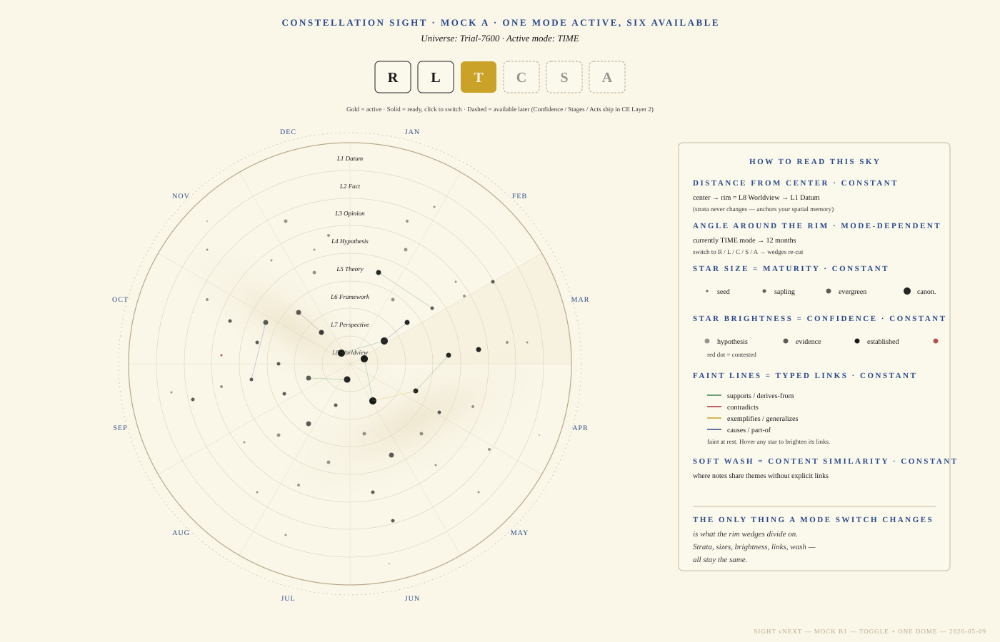

# Constellation Sight — Concept Paper v3.0

**Version:** 3.0 (canonical Sight v5 specification — fresh synthesis from the lineage)
**Date:** 2026-05-12
**Author:** Eisa Alshamsi · eisa@uconstellation.world · drafted with Claude.
**Status:** Draft for Eisa's validation and approval.
**Supersedes:** `Constellation-Sight-Concept-Paper-v2.0.md` (2026-05-09 — first Sight v5 spec, written immediately after the v.5 naming lock; this v3.0 is the cleaner second pass), and through it the older v1.x analytical paper, the v3 visual-and-interaction paper, and the v3 visual spec. All older papers stay on disk per SO #6.
**Reference visual:** `docs/Sight-vNext-MockB1-Toggle.svg` (the Mock B1 Eisa approved on 2026-05-09).

> **Why v3.0** (Eisa-directed, 2026-05-12):
>
> v2.0 was drafted in the same session as the v.5 naming lock, in one pass, while half a dozen design decisions were still hot. Two days of /migration discipline since then surfaced a number-collision (MIG-022 was already reserved for *this* paper's visual build, but a parallel gap-analysis-response cascade quietly took the slot) and revealed that the v2.0 framing — while sound — left the canonical Sight target ambiguous in living memory. Eisa: *"Familiarize yourself with everything about the Sight function up to the point when I told you we were going to name it Sight v5. Based on that, develop the Sight Concept paper for me to look at, validate, and approve. It has to include the mock-up."*
>
> v3.0 is that fresh synthesis. The substance is unchanged from v2.0 (the four foundational decisions Eisa ratified 2026-05-09 stand); the rewrite tightens the lineage, embeds the approved Mock B1 visual contract, makes the boundaries with adjacent surfaces explicit, and renames the visual-foundation MIG to a number that is genuinely free.

---

## §0 · What this paper IS (and is NOT)

**This paper IS the design contract for Constellation Sight v5.** Every implementation phase, every Architect doc, every code commit that touches Sight reconciles against this paper. Disagreements between this paper and the running app are resolved by amending this paper first, code second.

**This paper IS NOT a status report.** As of writing, **no Sight v5 visual code has been written.** Sight v4 (`SIGHT_V4_ENABLED = true` in `src/lib/sight/engine.ts`) is the user-visible Sight on `main`. v5 is gated on this paper's approval, the visual-foundation Architect doc, and Eisa's per-MIG sign-off under the /migration discipline.

**This paper IS NOT the Universal Epistemic Content Taxonomy.** The taxonomy is the scholarly foundation — see `docs/epistemic-content-taxonomy.md`, `docs/epistemic-content-EN.md`, `docs/epistemic-content-AR.md`, `docs/epistemic-content-taxonomy-chart.html`. This paper specifies how Sight v5 *uses* the taxonomy as backend vocabulary while keeping the user interface plain.

**This paper IS NOT a v4-to-v5 patch plan.** v5 is built fresh on a stable spatial grammar; v4 stays as the rollback target until Eisa confirms v5 across multiple sessions, then v4 retires in a cleanup MIG. v5 is not "v4 + extras."

---

## §1 · Executive summary

**Constellation Sight v5** is a single full-screen surface that visualizes a user's entire knowledge universe as a stable star chart on cream parchment. Each note is a star. The dome is divided into eight concentric strata bands (L1 Datum at the rim, L8 Worldview at the pole). Seven mode toggles re-cut the rim wedges to answer different cognitive questions; the strata radius, star size, brightness, and link colors stay constant across every mode.

Sight v5 answers exactly one question: **"How is my Epistemic Content shaped and/or organized?"** It does not analyze, score, recommend, or coach. It shows the user the shape of their own thinking through whichever cognitive lens they pick, with one image and one read.

The target experience: a first-time user with no Constellation training opens Sight v5 and within ~5 seconds can articulate what they're looking at. That ~5-second comprehension threshold is the load-bearing acceptance criterion — every other design decision is downstream of it.

---

## §2 · The canonical question

> *How is my Epistemic Content shaped and/or organized?*

This question was Eisa's call on 2026-05-09, replacing the InfraNodus-era framing (*"What patterns and gaps exist in my thinking?"* — analytical, prescriptive) with something quieter, more pre-prescriptive, and more honest about Sight's actual job. Eisa's exact words: *"Sight's one answer: How are my Epistemic Content shaped and/or organized? (so, forget about the InfraNodus.)"*

The question splits cleanly into two readings the visual surface answers simultaneously:

**Shape** — the *radial weight*. Where does my thinking concentrate? A user whose stars cluster mid-dome (L4-L5 Hypothesis-Theory) is in active conjecture. A user whose stars cluster near the rim (L1-L2 Datum-Fact) is collecting raw material. A user with bright stars near the pole (L7-L8 Perspective-Worldview) has synthesized.

**Organization** — the *angular distribution per active mode*. How is my thinking grouped? Under Regions: which library carries which strata. Under Time: in which months I produced what. Under Provenance: how much of my universe was perception versus inference versus testimony versus revelation.

Both readings are visible **at the same time, in every mode**. Shape lives on the radial axis (constant); organization lives on the angular axis (mode-dependent). The user toggles modes to ask different organization-questions while the shape (strata distribution) stays put.

What the question excludes is just as important: Sight v5 does not answer *"is my universe healthy?"* (that's the Knowledge Health Dashboard's job), *"where is X?"* (Search Hub), *"what's connected to what?"* (Sky View / Backlinks / Outgoing), or *"what is the structure of THIS note?"* (360.3D / Inspector). Each of those has its own surface; Sight is the universe-shape surface.

---

## §3 · Lineage — five Sight identities, one through-line

Sight has carried five names across thirteen months of iteration. Naming the lineage is not nostalgia — it is the audit trail that explains why v5 looks the way it does.

| Identity | Period | Visual grammar | What it taught |
|---|---|---|---|
| **Lens v0** | early 2026 (PDF concept paper) | Radial filter overlay on file tree | "Multiple cognitive angles into one universe" was the right idea; the filter UX was wrong. |
| **Lens v1** → **Sight v1 rename** | early-mid 2026 (`apply_lens` shipped) | Group-by-tag/property collapse | Group-by is a *query*, not a perceptual surface. Withdrawn 2026-05-09. |
| **Sight v2** | spring 2026 (`ConstellationSight2.svelte`, force-directed Pixi.js) | Force-directed graph with InfraNodus-style overlays (Brandes centrality, Louvain communities, structural gaps, universe health) | The math was right; the layout re-ran every session, so the user could never build a spatial mental map. |
| **Sight v3** | 2026-05-07 (Concept Paper + Visual Spec; partial implementation) | Star chart with **per-mode (X, Y, Z) grammar** — each mode declared its own azimuth, radius, magnitude; stars flew across the dome between modes | Star-chart aesthetic was right. Per-mode XYZ destroyed spatial memory the moment the user toggled a mode (the v2 problem in slow motion). |
| **Sight v4** | 2026-05-08 (Canvas 2D + D3-zoom) | Same v3 grammar; rendering tech swap to fix close-button regressions on a `position: fixed` overlay | Implementation lesson, not a design lesson. v4 is "v3 with a different render path." |

The through-line across all five: **the user wants a single image that shows the shape of their own thinking, anchored stably enough to learn.**

v2's force-directed instability and v3/v4's per-mode-XYZ instability both broke the same invariant: spatial memory. The v5 reframe makes spatial memory the load-bearing constraint:

- **Strata is the constant radius across all modes.** Eisa, 2026-05-09: *"strata as the constant radius across all modes (only azimuth changes per mode)."* This revokes v3's per-mode XYZ grammar entirely.
- **Color stops carrying community membership.** v2/v3 used Louvain palette. v5 uses ink black for ordinary stars, red for contested. Color is a state cue, not a topology cue.
- **InfraNodus heritage is dropped.** Brandes betweenness, Louvain communities, structural gaps, modularity-dominance-entropy-connectivity scoring — all out of Sight v5. Some of those analytics live elsewhere (Knowledge Health Dashboard); none of them live here.
- **Sight v5 is the canonical, supported Sight.** No "Sight v6 also exists." The numbering ladder ends at v5; future evolution happens inside v5's grammar.

The four other foundational decisions Eisa ratified in the same session, all binding on this paper:

1. **`lenses.rs::apply_lens` is deleted.** The withdrawn group-by mechanic is not part of v5; Pendings cleanup MIG retires the dead Rust code.
2. **Sight is the whole universe; 360.3D is the single note.** Mutually exclusive scopes. Selecting a star in Sight hands off to the editor / 360.3D — Sight does not deepen into a per-note view.
3. **If a first-time user can't understand v5, v5 doesn't exist.** Eisa: *"If future Constellation users don't understand it or think it is difficult, then its existence is unnecessary."* This is the ~5-second comprehension threshold formalized as an existence condition.
4. **Sources are tracked Day 1, not deferred.** This made Sources a real subsystem, not a future PJ — and made the Epistemic Classifier (§9) part of the v5 cradle.

---

## §4 · The scholarly foundation — Universal Epistemic Content Taxonomy

The InfraNodus heritage Sight v5 leaves behind was a *single-tradition analytical scaffold* (network science, betweenness centrality, modularity scoring). v5 replaces it with a *cross-civilizational scholarly scaffold* — the **Universal Epistemic Content Taxonomy** Eisa drafted 2026-05-09.

The taxonomy is two orthogonal axes, distilled from convergent structure across five major epistemological traditions plus four supplementary ones:

| Tradition | Key contribution to the taxonomy |
|---|---|
| Greek + Western analytic (Plato, Aristotle, Stoics, Kant, Frege, Russell, Polanyi) | The JTB analysis of knowledge; the *lekton* / propositional content; the Data-Information-Knowledge-Wisdom (DIKW) hierarchy |
| Sunni Islamic — *kalām*, *uṣūl al-fiqh*, *falsafa* (Al-Jurjānī, Al-Āmidī, Al-Ghazālī, Ibn Sīnā, Ibn Rushd) | The *taṣawwur* / *taṣdīq* binary; the graded epistemic-states scale (*shakk* → *ẓann* → *ʿilm* → *yaqīn*); the *masādir al-maʿrifah* (sources of knowledge) including the distinctively Sunni *al-tawātur* |
| Indian *pramāṇa-vāda* (Nyāya, Mīmāṃsā, Vedānta, Buddhist Dignāga / Dharmakīrti, Jaina) | The six *pramāṇa* (perception, inference, comparison, testimony, postulation, non-apprehension); the *prama* / *aprama* distinction |
| Classical Chinese (Mohist Canon, Confucian, Daoist, Neo-Confucian) | The *míng-shí* (name-reality) correspondence; the three sources (*wén zhī*, *shuō zhī*, *qīn zhī*); *zhī xíng hé yī* (unity of knowing and acting) |
| Persian-Islamic *Ishrāqī* (Suhrawardī) | *Al-ʿilm al-ḥuṣūlī* (representational knowledge) vs *al-ʿilm al-ḥuḍūrī* (presential knowledge) |

Plus supplementary input from Jewish (Maimonides), Tibetan Buddhist (Sa-paṇ), African (Wiredu, Oruka), and Mesoamerican (León-Portilla, Maffie) traditions.

### §4.1 The two axes

- **Vertical axis** — five primary branches of epistemic content: (1) Sensory inputs · (2) Symbolic entities · (3) Semantic contents · (4) Epistemic states · (5) Higher-order constructs.
- **Horizontal axis** — eleven sources / means of knowledge: perception · inference · testimony · mass-transmission · comparison · postulation · non-apprehension · memory · innate disposition · inspiration · revelation.

A single epistemic item is located by both axes: *what kind of content is it* (vertical) × *what source produced it* (horizontal). "The cat is on the mat" is a **proposition** (vertical: §3.3) produced by **perception** (horizontal: §S1).

### §4.2 Strata IS the Constellation projection of the vertical axis

Constellation already shipped an 8-level strata field (MIG-014, populated by the user across all 7,636 trial-universe notes). The 8 strata levels map cleanly onto the 5-branch vertical axis condensed by epistemic elevation:

| Stratum | Universal Taxonomy mapping |
|---|---|
| L1 Datum | Branch 1 (sensory inputs) + Branch 2.3 (data) |
| L2 Fact | Branch 3.5 (fact / *wāqiʿah*) |
| L3 Opinion | Branch 4.5 (epistemic state — *ẓann*) |
| L4 Hypothesis | Branch 5.1 (construct — *faraḍiyyah*) |
| L5 Theory | Branch 5.2 (*naẓariyyah*) |
| L6 Framework | Branches 5.3 – 5.5 (model / law / doctrine) |
| L7 Perspective | Branches 5.6 – 5.7 (insight / wisdom — *baṣīrah / ḥikmah*) |
| L8 Worldview | Branch 5.8 (*ruʾyah kawniyyah*) |

This is doubly-justified design: strata-as-radius is justified both by Constellation's native taxonomy (the user already labels every note with a stratum) AND by the cross-civilizational scholarly tradition the new taxonomy synthesizes. The user's existing labels become the spatial backbone of Sight v5 with no new annotation required.

### §4.3 Sources are the new dimension Sight v5 introduces

The horizontal axis (the 11 sources / *masādir al-maʿrifah* / *pramāṇa*) is **not yet tracked in Constellation today** — except where the MIG-021v3 CECE cascade has already started populating it. Sight v5 lifts it into a per-note frontmatter field and as the seventh Sight mode (P — Provenance). See §8 for the Sources subsystem.

---

## §5 · The visual grammar

Sight v5's visual is a circular star chart on Suwaidi cream parchment. The Mock B1 reference (approved by Eisa 2026-05-09) is the binding visual contract.

### §5.1 The Mock B1 visual contract



*Mock B1 — file: `docs/Sight-vNext-MockB1-Toggle.svg` (open in any modern browser to view at full resolution). Active mode shown is Time; the toggle bar above the dome shows R · L · T · C · S · A; the right-hand legend names the perceptual encodings in plain language. The legend's punchline is the load-bearing rule: "**THE ONLY THING A MODE SWITCH CHANGES is what the rim wedges divide on. Strata, sizes, brightness, links, wash — all stay the same.**"*

This mockup is the visual spec. Production code reconciles against it pixel-for-pixel (within the Suwaidi palette tokens defined in the SVG `<style>` block).

### §5.2 The dome

A circular field on Suwaidi cream parchment (`#faf6e8` background). Eight concentric strata bands divide the dome from the central pole (L8 Worldview) to the rim (L1 Datum). Faint sand grid lines (`#b8a98a`) mark each band boundary at low opacity (~0.5–0.55).

A 12-month calendar rim wraps the outside of the dome. Always present; serves the Time mode and provides a stable temporal reference in every other mode.

A soft Milky Way wash drifts across the chart in two diffuse ellipses (`#e6dec0` radial gradient, ~0.55 alpha at center fading to 0 at edges) — content-similarity density, the visual texture of *related themes that aren't explicitly linked*.

### §5.3 The stars

Each note is one circular dot — a star. Position, size, brightness, and color encode four orthogonal properties that **never change with mode**:

| Encoding | Property | Levels |
|---|---|---|
| **Radial position** (center → rim) | Strata | L8 pole → L1 rim. 8 bands. Never changes across modes. |
| **Angular position** (around the rim) | Active mode's wedge basis | Mode-dependent (see §6). The only thing a mode switch changes. |
| **Size** | Maturity | seed (1.5 px) → sapling (2.5) → evergreen (3.5) → canonical (5) → wilting (2, greyed) |
| **Brightness** (alpha) | Confidence | hypothesis (0.45) → evidence (0.7) → established (1.0) |
| **Color** | State | Ink (`#1a1a1a`) by default. Red (`#a83232`) for notes whose primary link confidence is *contested*. |

Library color is **not** used for stars. That's the Constellation Map's vocabulary. Sight uses strata-band rings as its grouping signal, not per-star color.

### §5.4 The connector lines

Faint at rest (~0.10–0.15 alpha), color-coded by typed-link kind:

| Color | Hex | Link kinds |
|---|---|---|
| Green | `#3a8a4a` | *supports* / *derives-from* |
| Red | `#a83232` | *contradicts* |
| Gold | `#c9a227` | *exemplifies* / *generalizes* |
| Blue ink | `#2a4a8c` | *causes* / *part-of* |

On hover or select, the focused star's incident edges brighten to ~0.85 alpha; other edges stay faint. **Principle 6 (reveal-on-demand) reframed:** *reveal* now means *brighten*, not *render-from-zero*. The structural pattern of the universe is always visible at rest; focus simply highlights what the user is looking at.

### §5.5 The toggle bar

A row of buttons at the top of the dome, naming the seven modes: **R · L · T · C · S · A · P**. Letter-buttons, ~50 × 44 px, 10 px gap, centered above the dome.

- **Active mode**: gold-filled background (`#c9a227`), parchment letter (`#faf6e8`), 600 weight.
- **Ready but inactive**: cream background (`#fbf8ec`), near-black letter (`#1a1a1a`), 1 px solid border.
- **Available later** (data not yet populated): cream background, faded letter (45 % opacity), dashed sand border (`#b8a98a`, dasharray `3 2`). Hover-tooltip explains what unlocks the mode (e.g., *"Available once you've assigned stages to your notes — see Settings → Stages"*).

A small caption under the bar names the active mode in the user's interface locale.

The Mock B1 SVG shows six buttons (R · L · T · C · S · A); the seventh (P — Provenance) is added once the Sources subsystem ships and the data is populated. This is intentional: P is dimmed-by-default for users who haven't classified, and active for users who have.

### §5.6 What is NEVER shown in the chrome

The visual chrome is plain language only. Sight v5 never surfaces:

- **Civilizational labels** ("Branch 2 Symbolic Entities", "*pramāṇa*", "*kalām*"). The taxonomy is the scholarly foundation; the UI uses Constellation-native vocabulary.
- **Network-science terminology** ("betweenness centrality", "Louvain modularity", "modularity score"). These are the InfraNodus heritage Sight v5 is leaving behind.
- **Numerical scores out of 100.** Sight v5 shows distributions visually; if the user wants a number, it appears in a hover-tooltip badge, never as a chrome element.

---

## §6 · The seven modes

Each mode declares its own **azimuth** (rim wedge slicing). Strata stays the radius. Star size, brightness, color, and link colors stay constant. The transition animation between modes (~600 ms ease) interpolates only the angular position of each star — stars slide tangentially around their stratum ring as the wedges re-cut.

| ID | Mode | Wedge basis | The cognitive question | Data source | Status |
|---|---|---|---|---|---|
| **R** | Regions | Library (sized by note count, biggest first) | "Where in my cosmos does this idea live?" | Library membership | Ready (existing) |
| **L** | Link Types | Dominant outgoing link type (9 typed-link kinds + Untyped) | "What kind of reasoning, and how versatile?" | `note_links.link_type` | Ready (existing) |
| **T** | Time | Creation month (12 wedges; current month subtly highlighted) | "When did it emerge, and is it still alive?" | `note_meta.created` | Ready (existing) |
| **C** | Confidence | Dominant per-note link confidence (4 wedges: hypothesis · evidence · established · contested) | "How certain, and how consistent?" | `note_links.confidence` | Ready (existing) |
| **S** | Stages | Dominant lifecycle stage (6 wedges: Spark → Birth → Growth → Maturity → Dormancy → Archival) | "How alive, and how worn the path?" | `note_meta.stage` | Ready (MIG-014) |
| **A** | Acts | Which Act produced the note (5 wedges: Observation → Connection → Tension → Synthesis → Conviction) | "Where in the formulation arc?" | per-note act tag | Partial (CE Layer 2) |
| **P** | Provenance | Primary source of the note's content (11 wedges from the taxonomy) | "What kind of knowing produced this?" | `note_meta.sources` | Ready (MIG-021v3 — populated incrementally) |

When a mode's data is partially populated, Sight v5 renders what's available and shows an "Unsourced" / "Unstaged" / "Unacted" wedge for the missing slice — the visible wedge becomes a to-do list. A universe whose Unsourced wedge dominates is a universe whose epistemic provenance has not been examined yet; the visual itself is the prompt.

### §6.1 Mode persistence

Last-used mode persists per Universe via `appSettings.sight.lastMode`. Default for first-time use: **R** (Regions) — the lowest-cognitive-load mode, since "which library carries which strata" is the most familiar cut for a new user. If the saved mode is unavailable (P before any sources are assigned, A before any acts are tagged), fall back to R.

### §6.2 Why no per-mode (X, Y, Z) grammar

The v3 visual spec had each mode declaring its own (X = azimuth, Y = radius, Z = magnitude). v5 revokes this. Four reasons:

1. **Spatial memory survives mode switches.** The user learns the dome once; mode toggles re-aim the lens through the same sky. If the same star sits at L7 in Regions and L7 in Confidence, the user remembers where it lives.
2. **The cognitive question maps cleanly to the visual axes.** *Shape* lives on the radius (constant strata); *organization* lives on the angular axis (mode-dependent wedges). One image, two readings.
3. **Cross-surface coherence with 360.3D.** 360.3D's Stratification Matrix anchors the per-note view to strata. Sight anchoring the per-universe view to strata makes the two surfaces echo — same axis, different scope. Eisa's "the focus of 360.3D is the Note, while Sight is the whole universe" is honored visually, not just verbally.
4. **The InfraNodus-derived (X = library, Y = centrality rank) Regions-mode anchor doesn't apply** with InfraNodus dropped. Centrality is no longer the radius. The natural successor is constant-strata-radius.

The cost of revoking per-mode XYZ: stars don't fly across the sky between modes. The v3 paper called this "the diagnostic migration trajectory" and argued it was a feature. v5 disagrees: a star that flies somewhere different in every mode is a star you can't find. Diagnostic patterns appear in the *wedge weights* (which library has the heaviest L7 cluster?), not in star migration.

---

## §7 · The four constants

These are the load-bearing invariants. Every mode honors them. Breaking any of them is a P0 regression that fails the ~5-second comprehension threshold.

| Constant | Encoded property | Source data |
|---|---|---|
| **Radial position** | Strata (L8 pole → L1 rim) | `note_meta.stratum` |
| **Size** | Maturity (5 sizes from seed to canonical) | `note_meta.maturity` |
| **Brightness** | Confidence (3 alpha levels from hypothesis to established) | derived from `note_links.confidence` (per-note primary) |
| **Color** | State (ink for ordinary; red for contested) | `note_links.link_type` + `confidence` (any inbound `contradicts` link with non-archived status → contested) |

The Mock B1 legend names all four constants with their semantic meaning. The user reads the legend once and never has to learn it again because the encoding never changes.

---

## §8 · The Sources subsystem

The Sources axis is the new dimension Sight v5 introduces. It is the horizontal axis of the Universal Epistemic Content Taxonomy lifted into Constellation as a per-note property.

### §8.1 The 11 sources

| # | English | Arabic | Sanskrit | Definition |
|---|---|---|---|---|
| 1 | Perception | الحِسّ | *pratyakṣa* | Direct sensory contact with an object |
| 2 | Inference | العَقل | *anumāna* | Derivation of conclusion from premises |
| 3 | Testimony | الخَبَر | *śabda* | Reliable verbal report from another knower |
| 4 | Mass-transmission | التَّواتُر | — | Convergent reports too numerous to collude on falsehood |
| 5 | Comparison | القياس | *upamāna* | Knowledge of an object via similarity to a known object |
| 6 | Postulation / IBE | الاستنباط الافتراضي | *arthāpatti* | Inference of an unobserved fact required to explain an observed one |
| 7 | Non-apprehension | عَدَم الإدراك | *anupalabdhi* | Knowledge of absence via the absence of perception |
| 8 | Memory | الذاكرة | *smṛti* | Recall of previously cognized content |
| 9 | Innate disposition | الفِطرة | — | Pre-experiential cognitive endowment |
| 10 | Inspiration | الإلهام | — | Non-discursive apprehension in mystical traditions |
| 11 | Revelation | الوحي | — | Communication from a divine source |

All 11 ship Day 1. Per the taxonomy's own pluralism on contested categories (§V of the taxonomy doc), Constellation does not editorialize: a journalist logging a quoted source picks *testimony*; a *Hadith* scholar picks *mass-transmission*; a poet logging a vision picks *inspiration*; a philosopher logging a deduction picks *inference*. Constellation provides the vocabulary and lets the user choose.

### §8.2 Per-note storage

**Frontmatter** (canonical, source of truth):

```yaml
sources:
  - testimony
  - mass-transmission
```

The list is **ordered**: first = primary source, subsequent = secondary. A note may have any number of sources from 0 to 11. An empty/missing field means *unsourced* (the user hasn't classified yet).

**SQLite mirror** (`note_meta.sources`, JSON-encoded list, fast-read index). Updated by the existing write-time `scan_note_*` pipeline that already maintains `stratum`, `maturity`, `stage`. Mirror policy matches MIG-014: frontmatter wins on disagreement; SQLite is the read cache. Write-time derivation per CLAUDE.md Rule 8 — the mirror is maintained at write time, not rebuilt at read time.

### §8.3 Setting sources — three paths

Per Eisa's six Sources sub-decisions (2026-05-09):

1. **PropertyEditor combobox** — multi-select dropdown listing all 11 sources in the user's interface locale. Matches the existing Strata / Maturity / Stage controls exactly (single-source-of-truth for property editing).
2. **Source Review sidebar panel** — a queue surface where the Epistemic Classifier (§9) presents its suggestions. User can Accept (writes to `sources:`), Edit (modify before accepting), or Reject (skip and clear the suggestion). Mirrors the existing Review Pulse panel pattern.
3. **Right-click → "Suggest sources for this note"** — context menu on any note (file tree, Sky View, Sight, anywhere a note is selectable). Triggers an on-demand single-note classification; result appears in the Source Review panel.

### §8.4 The "Unsourced" wedge in mode P

Notes whose `sources:` field is empty render in a dedicated **Unsourced** wedge in mode P. This wedge is the visible to-do list — its size shrinks as the user (with the classifier's help) classifies more of the universe.

### §8.5 What Sight v5 inherits from MIG-021v3

The MIG-021v3 cascade (CECE — Constellation Epistemic Content Engine, shipped 2026-05-11) already built:

- The `note_meta.sources` column + frontmatter contract
- The `sources_suggestions` table + Source Review panel
- A 6-cataloger ensemble that proposes sources for any note (User-Authority, Structural, Linguistic, Graph, Semantic, Reasoning — the last currently abstaining pending llama.cpp wiring)
- 15-locale i18n for every source label, every cataloger label, every confidence regime

So the **Sources data Sight v5 visualizes is already real** — it is being populated continuously through the Source Review workflow Eisa is using. By the time Sight v5's mode P ships, the trial Universe will have a meaningful Sources distribution to render.

---

## §9 · The Epistemic Classifier (CECE — already shipped as MIG-021v3)

The Constellation Epistemic Content Engine (CECE) is the subsystem that proposes source assignments for the user to approve. CECE shipped through MIG-021v3 (closed 2026-05-11). Sight v5 inherits CECE without modification; this section documents the contract for completeness.

### §9.1 Six-cataloger ensemble

CECE classifies a note through six methodologically distinct lenses, each producing its own reasoning trail:

| Cataloger | Lens | Cost tier |
|---|---|---|
| User-Authority | Frontmatter the user already wrote | Cheap |
| Structural | Citations + structural patterns (DOI/ISBN, blockquote+attribution, code blocks, etc.) | Cheap |
| Linguistic | CAE morphology + lexicon match + Bridge slow-path embedding for Arabic | Medium |
| Graph | Living Links typed-neighbor consensus | Medium |
| Semantic | Per-Library kNN-blend embedding similarity | Medium |
| Reasoning | Local LLM with GBNF grammar (deferred — abstains today) | Expensive |

A **synthesis layer** combines the six per-cataloger trails into one of three confidence regimes per axis (horizontal = Source, vertical = Content Type):

- **Unanimous** — all voiced catalogers agree. Single primary, no disambiguation needed.
- **Strong-majority** — clear winner with named dissenter. Single primary; trail surfaces who disagreed and why.
- **Split** — no clear winner. Engine refuses to assign and asks the user via Sibling Disambiguation chips.

### §9.2 LLM stack (Reasoning Cataloger when wired)

Per Eisa's 2026-05-09 picks (LLM research summary `lab/reports/MIG-021-LOCAL-LLM-RESEARCH.md`):

- **Bundled "starter" classifier**: reuse the existing `multilingual-e5-small` ONNX model (~113 MB, already shipping for semantic search). Embedding-similarity classification — Tier 1.
- **Optional larger classifier**: **Qwen3-1.7B Q4_K_M GGUF** (~1.1 GB), downloadable via Settings → AI. Apache 2.0, first-class Arabic, 25–45 tok/s on CPU. Tier 2.
- **Inference engine**: **llama.cpp** via the `llama-cpp-2` Rust crate. The killer feature is GBNF grammar-constrained decoding, which guarantees valid JSON output for the 11-source classification.
- **Bundling strategy**: the e5-small bundled classifier ships in the `.exe` so Sight v5 mode P works Day 1 with no network. Qwen3-1.7B is opt-in via Settings → AI.

Per Eisa's amendment 2026-05-10: **Reasoning Cataloger is local-only.** No cloud inference path exists in CECE. Privacy guarantee: source classification never leaves the device.

### §9.3 What's already running on Eisa's universe

As of 2026-05-12: CECE has classified ~270 cards on the trial Universe; the Source Review panel surfaces them with per-cataloger trails, queue composition filters (Both axes need your call · Source needs · Content type needs · Catalogers agreed), Sibling Disambiguation for Split regimes, Approve All / Reject All bulk actions, and full 15-locale i18n. The data Sight v5 will eventually visualize in mode P is already accumulating.

---

## §10 · What Sight v5 IS NOT

The 360.3D Concept Paper enumerates "what 360.3D is NOT vs Sky View, Map, Sight, Index, OrgChart." That section is load-bearing — it is the boundary that prevents accidental duplication. Sight's prior papers never wrote the reciprocal section. v5 writes it.

| Adjacent surface | What it answers | Why Sight v5 is not it |
|---|---|---|
| **Sky View** | "What does my note network *feel* like, alive?" | Sky View is a force-directed PIXI bubble graph showing the live nervous-system topology. Sight v5 is a stable star chart anchored by strata. Different visual grammar, different question. Sky View has bubbles; Sight has stars-by-strata. |
| **Constellation Map** | "What is the shape and density of my libraries?" | The Map is a D3 sunburst tracking the file-tree hierarchy (Universe → cUniverses → Libraries → Folders → Notes). Sight v5 is a sky chart tracking epistemic content distribution. Different organizing principle (hierarchy vs strata). The Map has sunburst arcs; Sight has stars. |
| **OrgChart** | "What is my Universe's organizational hierarchy?" | OrgChart is the connector-box tree of structural containment. Sight v5 doesn't show containment; it shows distribution. |
| **Search Hub** | "Where in my system does this term/link/concept exist?" | Search is point-query against a corpus. Sight is whole-universe distribution. Zero use-case overlap. |
| **Index Panel** | "Which terms appear in my notes and where?" | Index is term-level vocabulary browsing (built on FTS5). Sight is note-level epistemic distribution. Adjacent surfaces, orthogonal jobs. |
| **360.3D / Inspector 360** | "Where does THIS note stand? (Position / Profile / Absence)" | **Eisa's load-bearing line, 2026-05-09**: 360.3D = single note; Sight = whole universe. Mutually exclusive scopes. Selecting a note in Sight should hand off to 360.3D / the editor — not deepen Sight's own per-note view. |
| **Knowledge Health Dashboard** | "What's the health of my link-graph (lifecycle, decay, hubs, weak foundations, bias alerts)?" | KHD is link-graph diagnostics. Sight is epistemic content distribution. The InfraNodus-era universe-level metrics (modularity, dominance, entropy, connectivity) live in KHD; they are NOT replicated in Sight v5. |
| **Source Review panel** (CECE) | "Which source-classification suggestions need my approval?" | Source Review is the queue surface for accepting/editing/rejecting one note's sources at a time. Sight v5 visualizes the *aggregate* result across the universe, not the per-note classification workflow. |
| **Multi-Lens** (`lenses.rs::apply_lens`) | (was: "group notes by tag / property") | WITHDRAWN 2026-05-09. `apply_lens` queued for deletion. The "group-by" job is reframed as Sight's multi-mode wedges. |

The five-core-functions invariant from 2026-04-13 still holds: **Search Hub · OrgChart · Sky View · Map · Sight** are the five non-overlapping cognitive surfaces. 360.3D, KHD, Index, Backlinks, Outgoing, Tags, Tasks, Calendar, Tension, Source Review, Sense-Making Canvas, Expression Forge, etc. are adjacent surfaces with their own non-overlapping jobs.

---

## §11 · Performance budgets

Per CLAUDE.md Performance Rules + the 2026-04-15 boot-perf discipline:

| Metric | Budget | Notes |
|---|---|---|
| First-toggle latency on 7,636-note universe (cold) | ≤ 500 ms | Layout cache miss; rebuild + draw |
| First-toggle latency (warm SQLite cache) | ≤ 50 ms | Layout cached; draw only |
| Mode-switch animation (R ↔ L ↔ T ↔ ...) | 600 ms ease | Pure JS re-projection, no IPC |
| Hover-star highlight | ≤ 16 ms (single frame) | Decoration on focus overlay only |
| Idle-Sight per-frame cost (no hover, no select) | ≤ 1 ms | Static base layer; no redraw |
| Memory footprint (Sight open, 7,636 notes) | ≤ 40 MB above app baseline | Two Canvas 2D layers + DOM overlays |
| Boot impact | **Zero** | Sight is lazy-mounted on dock-button click; layout cache warmed via `requestIdleCallback` after `boot:hydrated` |

The classifier (CECE) has its own budgets per the MIG-021v3 close-out (V3-§8.r5 and following).

---

## §12 · Phased rollout

Sight v5 ships across two sequenced MIGs (the third — Cleanup — retires v4 once v5 is Eisa-confirmed-stable). The MIG numbers below RESERVE the slots; actual numbers assigned at Architect-doc time.

> **Note on numbering** (2026-05-12 recalibration): the v2.0 Concept Paper's §11 reserved MIG-022 / MIG-023 / cleanup-MIG-NN. A parallel cascade (gap-analysis response: PJ-040/041/042/043 + history-axis Rust foundation) shipped under "MIG-022" before this paper landed. v3.0 does NOT pre-assign numbers; the actual MIG numbers will be chosen at Architect time against the live Pending Jobs ledger.

### §12.1 MIG-NN (visual foundation)

Lands the dome, the eight strata bands, the calendar rim, the toggle bar with R + T modes (the two whose data is fully populated and least controversial), the four constant encodings (radius / size / brightness / color), the connector-line layer with hover/select brightening, and the side panel for selected-star detail.

**Eisa-test gate:** open Sight v5 from the dock; the dome renders correctly on the trial Universe in both R and T modes; mode toggle and migration animation work; hover / select / Esc behaviors work; the close button works (the v3/v4 lesson — mount inside `.content-area` per SkyView pattern, NOT `position: fixed` overlay).

### §12.2 MIG-NN+1 (mode completion + classifier-Tier-2 close-out)

Lands the remaining five modes — L (Link Types), C (Confidence), S (Stages), A (Acts), P (Provenance) — each gated on its data being available. Lands the optional Qwen3-1.7B download path, the Tier-2 inference engine wiring via `llama-cpp-2`, the Settings → AI panel for downloading and managing the larger classifier, and the comprehensive 15-locale help docs + User Manual rewrite of the Sight section.

**Eisa-test gate:** full mode rotation (R → L → T → C → S → A → P) on a Universe with sources populated, optional download path tested end-to-end, accuracy comparison between Tier 1 and Tier 2 on a hand-labeled subset.

### §12.3 Cleanup MIG (number TBD)

Deletes `lenses.rs::apply_lens` (CE Phase 9 withdrawn), the orphaned `constellation_sight_*` IPCs in the old `sight.rs`, the v2/v3/v4 Sight Svelte components (after Eisa confirms v5 stable across multiple sessions), and moves the obsolete v1.x / v2.0 / v3-paper files to `docs/historical/`.

---

## §13 · Acceptance criteria

For Sight v5 to close as Done:

1. The five-core-functions invariant holds: Sight v5 does not duplicate Search Hub, OrgChart, Sky View, Map, or any adjacent surface (per §10).
2. **A first-time user with no Constellation training opens Sight v5 and can articulate within ~5 seconds what they're looking at.** This is the load-bearing existence-condition from Eisa's 2026-05-09 directive.
3. All seven modes render correctly on the 7,636-note trial Universe within performance budgets (§11).
4. Mode toggle preserves spatial memory: the same star sits at the same strata band in every mode.
5. The four constants (radial position / size / brightness / color) hold across every mode without exception.
6. Sources field populated for ≥ 80 % of the trial Universe via the CECE-and-approval workflow (already underway via MIG-021v3).
7. Both Tier 1 (bundled e5-small) and Tier 2 (optional Qwen3-1.7B) classifier paths work end-to-end.
8. Help docs + User Manual (EN + AR canonical, 13 other locales queued) describe Sight v5 as it ships.
9. Three-agent integration audit clean across all Sight-v5 MIGs.
10. Eisa confirms across multiple sessions that Sight v5 delivers the at-a-glance promise.

---

## §14 · Glossary

| Term | Definition |
|---|---|
| **Sight v5** | The fifth Sight implementation generation. Star-chart aesthetic, taxonomy-spined, seven modes, strata-as-radius. The canonical Sight target. |
| **Star** | A note rendered as a circular dot on the dome. |
| **Strata band** | A concentric ring on the dome corresponding to one of the eight stratum levels (L1 Datum at rim, L8 Worldview at pole). |
| **Mode** | A wedge-slicing scheme that reorganizes the rim. Seven modes: R / L / T / C / S / A / P. |
| **Wedge** | A radial sector of the dome corresponding to one bucket of the active mode (a month, a library, a stage, a source...). |
| **Universal Epistemic Content Taxonomy** | The cross-civilizational scholarly framework Sight v5 uses as backend vocabulary. Five branches (vertical) × eleven sources (horizontal). See `docs/epistemic-content-taxonomy.md`. |
| **Source** | One of the 11 *masādir al-maʿrifah* / *pramāṇa* drawn from the taxonomy's horizontal axis. Per-note frontmatter field. |
| **Provenance (mode P)** | The Sight v5 mode whose wedges are the 11 sources. |
| **CECE** | Constellation Epistemic Content Engine. The 6-cataloger ensemble that proposes source assignments. Shipped MIG-021v3 (2026-05-11). |
| **Tier 1 / Tier 2 classifier** | Bundled (e5-small embedding similarity) vs optional-download (Qwen3-1.7B with GBNF grammar) classifier paths. |
| **Source Review panel** | The sidebar surface where the user approves CECE suggestions. Lives in the Constellation right sidebar; complements Sight v5 but is not part of it. |
| **The four constants** | Radial position (strata), size (maturity), brightness (confidence), color (state). The encodings that never change with mode. |
| **The ~5-second rule** | A first-time user articulates what they're looking at within ~5 seconds. The acceptance criterion that gates v5 shipping. |
| **Mock B1** | The visual reference Eisa approved 2026-05-09. File: `docs/Sight-vNext-MockB1-Toggle.svg`. The binding visual contract. |

---

## §15 · Cross-references

- `docs/Sight-vNext-MockB1-Toggle.svg` — **the approved visual reference** (Mock B1).
- `docs/Sight-vNext-MockB2-Compare.svg` — two-dome compare view (help-doc teaching diagram only — NOT production UX).
- `docs/Sight-vNext-MockA-Dashboard.svg` — alternative dashboard mock (rejected; kept as historical record).
- `docs/epistemic-content-taxonomy.md` — formal two-axis taxonomy, bilingual EN/AR.
- `docs/epistemic-content-EN.md` — comparative civilizational essay, English (the intellectual case).
- `docs/epistemic-content-AR.md` — Arabic version.
- `docs/epistemic-content-taxonomy-chart.html` — interactive 5-level chart, self-contained, bilingual.
- `docs/360.3D-Concept-Paper-v1.0.md` — the per-note diagnostic surface; explicit "what is NOT" boundary partner.
- `lab/reports/MIG-021-LOCAL-LLM-RESEARCH.md` — the LLM research that informed §9.
- **Obsoleted by this paper, preserved as historical record:**
  - `docs/Constellation-Sight-Concept-Paper-v2.0.md` — the previous Sight v5 spec (this v3.0 supersedes).
  - `docs/Constellation-Sight-Concept-Paper-v1.1.md` — InfraNodus-spined analytical foundation.
  - `docs/Constellation-Sight-v3-Concept-Paper-v1.0.md` and `v1.1.md` — per-mode (X, Y, Z) grammar.
  - `docs/SIGHT-V3-VISUAL-SPEC.md` — codification of the per-mode grammar.

---

**End of v3.0.** This paper is the design contract for Sight v5, awaiting Eisa's validation and approval. Once approved, the next document in the chain is the Sight v5 visual-foundation **Architect doc** — the first of two MIG cycles that build Sight v5.
